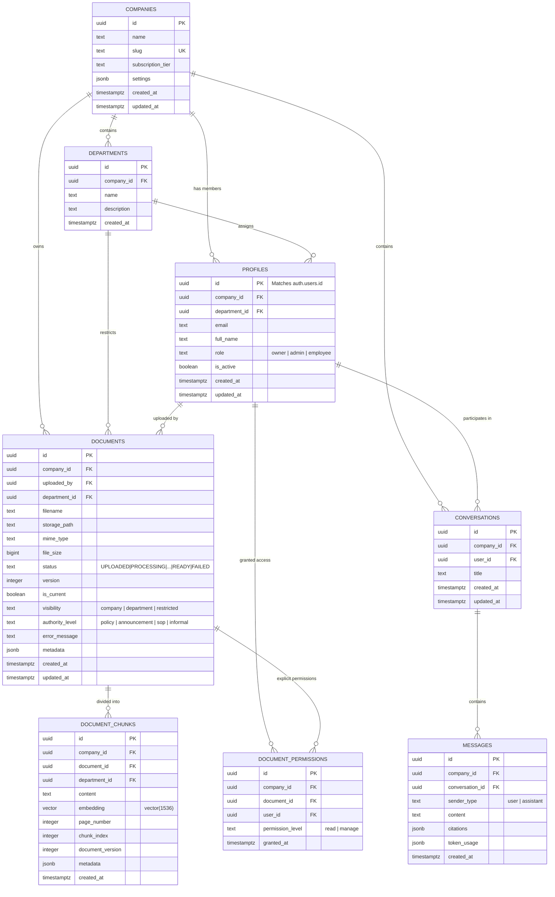

# CorpusAI — Database Design Specification

## 1. Architectural Overview

CorpusAI utilizes a **Single-Database, Shared-Schema Multi-Tenant Model** powered by PostgreSQL 16 on Supabase. Every company entity resides in the same database schema, isolated deterministically by a tenant discriminator (`company_id`) present on all tables. 

Data isolation is guaranteed through **PostgreSQL Row Level Security (RLS)**, ensuring that even in the event of an application-layer bug or improper SQL query, the database kernel strictly suppresses rows belonging to another tenant.

Furthermore, CorpusAI leverages the **`pgvector` extension** to store vector embeddings directly alongside text chunks in PostgreSQL, enabling atomic transactions, consolidated backups, and relational joins between vector distances and tenant permissions.

---

## 2. Entity-Relationship Diagram (ERD)



---

## 3. Detailed Table Specifications

### 3.1 `companies`
- **Purpose**: Defines corporate tenants. Each tenant represents an isolated organization with its own documents, users, and conversations.
- **Tenant Ownership**: Root tenant entity.
- **Primary Key**: `id UUID DEFAULT gen_random_uuid()`
- **Columns**:
  | Column | Type | Constraints | Description |
  | :--- | :--- | :--- | :--- |
  | `id` | `UUID` | `PRIMARY KEY` | Unique tenant identifier. |
  | `name` | `TEXT` | `NOT NULL` | Display name of the enterprise. |
  | `slug` | `TEXT` | `NOT NULL, UNIQUE` | URL-friendly unique identifier (e.g., `acme-corp`). |
  | `subscription_tier` | `TEXT` | `NOT NULL DEFAULT 'starter'` | Tier: `'starter'`, `'growth'`, `'enterprise'`. |
  | `max_documents` | `INTEGER` | `NOT NULL DEFAULT 100` | Ingestion quota limit for the tenant. |
  | `max_storage_bytes` | `BIGINT` | `NOT NULL DEFAULT 5368709120` | Storage quota (default 5 GB). |
  | `settings` | `JSONB` | `NOT NULL DEFAULT '{}'::jsonb` | Tenant-level settings (default LLM model, temperature, retention). |
  | `created_at` | `TIMESTAMPTZ` | `NOT NULL DEFAULT NOW()` | Timestamp of creation. |
  | `updated_at` | `TIMESTAMPTZ` | `NOT NULL DEFAULT NOW()` | Timestamp of last modification. |
- **Indexes**:
  - `CREATE UNIQUE INDEX idx_companies_slug ON companies(slug);`
- **RLS Considerations**:
  - Tenant members may `SELECT` their own company row (`id = (SELECT company_id FROM profiles WHERE id = auth.uid())`).
  - Only users with `role = 'owner'` may `UPDATE` company settings.
  - Creation occurs during registration through a secure database trigger or service function.

---

### 3.2 `departments`
- **Purpose**: Represents organizational units within a company (e.g., Human Resources, Engineering, Legal, Finance) to enable department-scoped document access.
- **Tenant Ownership**: Belongs to `company_id`.
- **Primary Key**: `id UUID DEFAULT gen_random_uuid()`
- **Foreign Keys**:
  - `company_id` &rarr; `companies(id) ON DELETE CASCADE`
- **Columns**:
  | Column | Type | Constraints | Description |
  | :--- | :--- | :--- | :--- |
  | `id` | `UUID` | `PRIMARY KEY` | Unique department identifier. |
  | `company_id` | `UUID` | `NOT NULL, REFERENCES companies(id)` | Tenant identifier. |
  | `name` | `TEXT` | `NOT NULL` | Department name (e.g., "Human Resources"). |
  | `description` | `TEXT` | `NULL` | Department scope description. |
  | `created_at` | `TIMESTAMPTZ` | `NOT NULL DEFAULT NOW()` | Timestamp of creation. |
- **Indexes**:
  - `CREATE INDEX idx_departments_company_id ON departments(company_id);`
  - `CREATE UNIQUE INDEX idx_departments_company_name ON departments(company_id, LOWER(name));`
- **RLS Considerations**:
  - Any verified employee of the company may `SELECT` departments.
  - Only `Company Owner` or `Company Admin` can `INSERT`, `UPDATE`, or `DELETE`.

---

### 3.3 `profiles`
- **Purpose**: Extends Supabase Auth (`auth.users`) with tenant association, department membership, and role authorization.
- **Tenant Ownership**: Belongs to `company_id`.
- **Primary Key**: `id UUID REFERENCES auth.users(id) ON DELETE CASCADE`
- **Foreign Keys**:
  - `company_id` &rarr; `companies(id) ON DELETE CASCADE`
  - `department_id` &rarr; `departments(id) ON DELETE SET NULL`
- **Columns**:
  | Column | Type | Constraints | Description |
  | :--- | :--- | :--- | :--- |
  | `id` | `UUID` | `PRIMARY KEY` | Matches Supabase Auth user UUID. |
  | `company_id` | `UUID` | `NOT NULL, REFERENCES companies(id)` | Tenant binding. |
  | `department_id` | `UUID` | `NULL, REFERENCES departments(id)` | Department membership. |
  | `email` | `TEXT` | `NOT NULL` | User email address. |
  | `full_name` | `TEXT` | `NOT NULL` | User display name. |
  | `role` | `TEXT` | `NOT NULL DEFAULT 'employee'` | Role: `'owner'`, `'admin'`, `'employee'`. |
  | `is_active` | `BOOLEAN` | `NOT NULL DEFAULT TRUE` | Account active flag. |
  | `created_at` | `TIMESTAMPTZ` | `NOT NULL DEFAULT NOW()` | Timestamp of profile creation. |
  | `updated_at` | `TIMESTAMPTZ` | `NOT NULL DEFAULT NOW()` | Timestamp of last modification. |
- **Indexes**:
  - `CREATE INDEX idx_profiles_company_id ON profiles(company_id);`
  - `CREATE INDEX idx_profiles_department_id ON profiles(department_id);`
  - `CREATE INDEX idx_profiles_email ON profiles(email);`
- **RLS Considerations**:
  - Users can read all active profiles in their own company (for user directories and collaboration).
  - Users can update their own profile (`id = auth.uid()`, restricted to `full_name`).
  - Company Owners and Admins can update roles and department assignments within their company.

---

### 3.4 `documents`
- **Purpose**: Stores metadata, processing lifecycle state, access permissions, and storage references for company documents.
- **Tenant Ownership**: Belongs to `company_id`.
- **Primary Key**: `id UUID DEFAULT gen_random_uuid()`
- **Foreign Keys**:
  - `company_id` &rarr; `companies(id) ON DELETE CASCADE`
  - `uploaded_by` &rarr; `profiles(id) ON DELETE SET NULL`
  - `department_id` &rarr; `departments(id) ON DELETE SET NULL`
  - `superseded_by` &rarr; `documents(id) ON DELETE SET NULL` (Self-referencing for versioning)
- **Columns**:
  | Column | Type | Constraints | Description |
  | :--- | :--- | :--- | :--- |
  | `id` | `UUID` | `PRIMARY KEY` | Unique document identifier. |
  | `company_id` | `UUID` | `NOT NULL, REFERENCES companies(id)` | Tenant identifier. |
  | `uploaded_by` | `UUID` | `NULL, REFERENCES profiles(id)` | User who uploaded the file. |
  | `department_id` | `UUID` | `NULL, REFERENCES departments(id)` | Scoped department (if restricted). |
  | `filename` | `TEXT` | `NOT NULL` | Original uploaded filename. |
  | `storage_path` | `TEXT` | `NOT NULL` | Object path in Supabase Storage. |
  | `mime_type` | `TEXT` | `NOT NULL` | MIME type (`application/pdf`, etc.). |
  | `file_size` | `BIGINT` | `NOT NULL` | Size in bytes. |
  | `status` | `TEXT` | `NOT NULL DEFAULT 'UPLOADED'` | Lifecycle: `UPLOADED`, `PROCESSING`, `EXTRACTED`, `CHUNKED`, `EMBEDDED`, `INDEXED`, `READY`, `FAILED`. |
  | `version` | `INTEGER` | `NOT NULL DEFAULT 1` | Document version number. |
  | `is_current` | `BOOLEAN` | `NOT NULL DEFAULT TRUE` | Active document flag for temporal filtering. |
  | `superseded_by` | `UUID` | `NULL, REFERENCES documents(id)` | Pointer to newer replacement document. |
  | `visibility` | `TEXT` | `NOT NULL DEFAULT 'company'` | Scope: `'company'`, `'department'`, `'restricted'`. |
  | `authority_level`| `TEXT` | `NOT NULL DEFAULT 'sop'` | Source authority: `'policy'`, `'announcement'`, `'sop'`, `'informal'`. |
  | `total_chunks` | `INTEGER` | `NOT NULL DEFAULT 0` | Count of generated chunks. |
  | `total_pages` | `INTEGER` | `NOT NULL DEFAULT 0` | Total parsed page count. |
  | `error_message` | `TEXT` | `NULL` | Ingestion failure message (sanitized). |
  | `metadata` | `JSONB` | `NOT NULL DEFAULT '{}'::jsonb` | Arbitrary custom metadata tags. |
  | `created_at` | `TIMESTAMPTZ` | `NOT NULL DEFAULT NOW()` | Upload timestamp. |
  | `updated_at` | `TIMESTAMPTZ` | `NOT NULL DEFAULT NOW()` | Last update timestamp. |
- **Indexes**:
  - `CREATE INDEX idx_documents_company_id ON documents(company_id);`
  - `CREATE INDEX idx_documents_status ON documents(company_id, status);`
  - `CREATE INDEX idx_documents_department ON documents(company_id, department_id);`
  - `CREATE INDEX idx_documents_visibility ON documents(company_id, visibility);`
- **RLS Considerations**:
  - `SELECT`: Allowed if `company_id` matches and user has permission (visibility is company-wide, or matches user department, or is explicitly granted in `document_permissions`, or user is Admin/Owner).
  - `INSERT`: Allowed for Owners, Admins, or authorized Employees.
  - `UPDATE` / `DELETE`: Allowed only for Owners, Admins, or document uploader.

---

### 3.5 `document_permissions`
- **Purpose**: Provides fine-grained discretionary access control (DAC) for restricted documents to individual users.
- **Tenant Ownership**: Belongs to `company_id`.
- **Primary Key**: `id UUID DEFAULT gen_random_uuid()`
- **Foreign Keys**:
  - `company_id` &rarr; `companies(id) ON DELETE CASCADE`
  - `document_id` &rarr; `documents(id) ON DELETE CASCADE`
  - `user_id` &rarr; `profiles(id) ON DELETE CASCADE`
- **Columns**:
  | Column | Type | Constraints | Description |
  | :--- | :--- | :--- | :--- |
  | `id` | `UUID` | `PRIMARY KEY` | Unique permission record identifier. |
  | `company_id` | `UUID` | `NOT NULL, REFERENCES companies(id)` | Tenant identifier. |
  | `document_id` | `UUID` | `NOT NULL, REFERENCES documents(id)` | Target document. |
  | `user_id` | `UUID` | `NOT NULL, REFERENCES profiles(id)` | Authorized user. |
  | `permission_level` | `TEXT` | `NOT NULL DEFAULT 'read'` | `'read'`, `'manage'`. |
  | `granted_at` | `TIMESTAMPTZ` | `NOT NULL DEFAULT NOW()` | Grant timestamp. |
- **Indexes**:
  - `CREATE UNIQUE INDEX idx_doc_perm_unique ON document_permissions(document_id, user_id);`
  - `CREATE INDEX idx_doc_perm_user ON document_permissions(user_id, company_id);`
- **RLS Considerations**:
  - Accessible only within the same `company_id`. Managed exclusively by Owners and Admins.

---

### 3.6 `document_chunks`
- **Purpose**: Stores partitioned text segments and their dense vector embeddings for RAG retrieval.
- **Tenant Ownership**: Belongs to `company_id`.
- **Primary Key**: `id UUID DEFAULT gen_random_uuid()`
- **Foreign Keys**:
  - `company_id` &rarr; `companies(id) ON DELETE CASCADE`
  - `document_id` &rarr; `documents(id) ON DELETE CASCADE`
  - `department_id` &rarr; `departments(id) ON DELETE SET NULL`
- **Columns**:
  | Column | Type | Constraints | Description |
  | :--- | :--- | :--- | :--- |
  | `id` | `UUID` | `PRIMARY KEY` | Unique chunk identifier. |
  | `company_id` | `UUID` | `NOT NULL, REFERENCES companies(id)` | Tenant identifier (for index filtering). |
  | `document_id` | `UUID` | `NOT NULL, REFERENCES documents(id)` | Parent document identifier. |
  | `department_id` | `UUID` | `NULL, REFERENCES departments(id)` | Inherited department ID for rapid indexing. |
  | `content` | `TEXT` | `NOT NULL` | Clean text chunk string. |
  | `embedding` | `vector(1536)` | `NOT NULL` | Dense float vector (pgvector). |
  | `page_number` | `INTEGER` | `NOT NULL DEFAULT 1` | Source page number for citations. |
  | `chunk_index` | `INTEGER` | `NOT NULL` | Ordinal position in document (0, 1, 2...). |
  | `document_version`| `INTEGER` | `NOT NULL DEFAULT 1` | Inherited document version. |
  | `token_count` | `INTEGER` | `NOT NULL` | Exact token count of the chunk. |
  | `metadata` | `JSONB` | `NOT NULL DEFAULT '{}'::jsonb` | Rich metadata (headings, tables, timestamps). |
  | `created_at` | `TIMESTAMPTZ` | `NOT NULL DEFAULT NOW()` | Chunk generation timestamp. |
- **Indexes**:
  - `CREATE INDEX idx_chunks_company_doc ON document_chunks(company_id, document_id);`
  - `CREATE INDEX idx_chunks_department ON document_chunks(company_id, department_id);`
  - `CREATE INDEX idx_chunks_embedding_hnsw ON document_chunks USING hnsw (embedding vector_cosine_ops) WITH (m = 16, ef_construction = 64);`
- **RLS Considerations**:
  - Reading chunks is restricted to users who have authorized access to the parent document.

---

### 3.7 `conversations`
- **Purpose**: Groups interaction turns between an employee and the CorpusAI assistant into a persistent thread.
- **Tenant Ownership**: Belongs to `company_id`.
- **Primary Key**: `id UUID DEFAULT gen_random_uuid()`
- **Foreign Keys**:
  - `company_id` &rarr; `companies(id) ON DELETE CASCADE`
  - `user_id` &rarr; `profiles(id) ON DELETE CASCADE`
- **Columns**:
  | Column | Type | Constraints | Description |
  | :--- | :--- | :--- | :--- |
  | `id` | `UUID` | `PRIMARY KEY` | Unique conversation identifier. |
  | `company_id` | `UUID` | `NOT NULL, REFERENCES companies(id)` | Tenant identifier. |
  | `user_id` | `UUID` | `NOT NULL, REFERENCES profiles(id)` | Thread creator. |
  | `title` | `TEXT` | `NOT NULL DEFAULT 'New Conversation'` | Human-readable thread topic. |
  | `created_at` | `TIMESTAMPTZ` | `NOT NULL DEFAULT NOW()` | Creation timestamp. |
  | `updated_at` | `TIMESTAMPTZ` | `NOT NULL DEFAULT NOW()` | Last message timestamp. |
- **Indexes**:
  - `CREATE INDEX idx_conversations_user ON conversations(company_id, user_id, updated_at DESC);`
- **RLS Considerations**:
  - Employees can only `SELECT`, `INSERT`, `UPDATE`, or `DELETE` their own conversations (`user_id = auth.uid()` and `company_id = profile.company_id`).

---

### 3.8 `messages`
- **Purpose**: Stores individual prompt turns, generated responses, citations, and token usage within a conversation.
- **Tenant Ownership**: Belongs to `company_id`.
- **Primary Key**: `id UUID DEFAULT gen_random_uuid()`
- **Foreign Keys**:
  - `company_id` &rarr; `companies(id) ON DELETE CASCADE`
  - `conversation_id` &rarr; `conversations(id) ON DELETE CASCADE`
- **Columns**:
  | Column | Type | Constraints | Description |
  | :--- | :--- | :--- | :--- |
  | `id` | `UUID` | `PRIMARY KEY` | Unique message identifier. |
  | `company_id` | `UUID` | `NOT NULL, REFERENCES companies(id)` | Tenant identifier. |
  | `conversation_id` | `UUID` | `NOT NULL, REFERENCES conversations(id)` | Parent thread. |
  | `sender_type` | `TEXT` | `NOT NULL` | `'user'` or `'assistant'`. |
  | `content` | `TEXT` | `NOT NULL` | Message body. |
  | `citations` | `JSONB` | `NOT NULL DEFAULT '[]'::jsonb` | Grounded source citations (document ID, title, page). |
  | `token_usage` | `JSONB` | `NOT NULL DEFAULT '{}'::jsonb` | Model prompt/completion token metrics. |
  | `model_provider` | `TEXT` | `NULL` | Model identifier used (e.g., `'grok-beta'`, `'qwen-2.5'`). |
  | `created_at` | `TIMESTAMPTZ` | `NOT NULL DEFAULT NOW()` | Message timestamp. |
- **Indexes**:
  - `CREATE INDEX idx_messages_conversation ON messages(conversation_id, created_at ASC);`
- **RLS Considerations**:
  - Accessible only if the user has access to the parent conversation (`user_id = auth.uid()`).

---

## 4. PostgreSQL Row Level Security (RLS) Strategy

Every multi-tenant table has `ALTER TABLE <table_name> ENABLE ROW LEVEL SECURITY;` applied.

### Context Setting Pattern
When the Flask backend executes queries using connection pooling, it establishes session claims for the authenticated user:
```sql
SELECT set_config('app.current_user_id', :user_id, true);
SELECT set_config('app.current_company_id', :company_id, true);
```

### Core Security Policies

#### 1. Tenant Isolation Policy (`documents` table example)
```sql
-- Ensure users only see documents belonging to their company and matching permission scope
CREATE POLICY tenant_document_isolation_select ON documents
FOR SELECT
USING (
    company_id = NULLIF(current_setting('app.current_company_id', true), '')::uuid
    AND (
        -- Company-wide documents
        visibility = 'company'
        -- Or documents scoped to user's department
        OR (
            visibility = 'department' 
            AND department_id = (SELECT department_id FROM profiles WHERE id = NULLIF(current_setting('app.current_user_id', true), '')::uuid)
        )
        -- Or documents where user is explicitly granted permission
        OR EXISTS (
            SELECT 1 FROM document_permissions dp
            WHERE dp.document_id = documents.id
              AND dp.user_id = NULLIF(current_setting('app.current_user_id', true), '')::uuid
        )
        -- Or user is an Admin/Owner of the company
        OR EXISTS (
            SELECT 1 FROM profiles p
            WHERE p.id = NULLIF(current_setting('app.current_user_id', true), '')::uuid
              AND p.role IN ('owner', 'admin')
        )
    )
);
```

#### 2. Vector Chunk Security Policy (`document_chunks` table)
```sql
-- Chunks can only be retrieved if the parent document is accessible
CREATE POLICY tenant_chunk_isolation_select ON document_chunks
FOR SELECT
USING (
    company_id = NULLIF(current_setting('app.current_company_id', true), '')::uuid
    AND EXISTS (
        SELECT 1 FROM documents d
        WHERE d.id = document_chunks.document_id
          AND d.company_id = document_chunks.company_id
    )
);
```

#### 3. Conversation Thread Security Policy (`conversations` table)
```sql
CREATE POLICY tenant_conversation_isolation ON conversations
FOR ALL
USING (
    company_id = NULLIF(current_setting('app.current_company_id', true), '')::uuid
    AND user_id = NULLIF(current_setting('app.current_user_id', true), '')::uuid
);
```

---

## 5. pgvector Indexing & Query Plan Optimization

### HNSW vs IVFFlat Index Selection
- **HNSW (Hierarchical Navigable Small World)** is selected over IVFFlat.
- **Rationale**:
  - HNSW does not require a training step before indexing.
  - Provides superior query recall (>98%) at high queries per second.
  - Incrementally updates cleanly as new documents are ingested one by one without degrading index quality.
- **Index Configuration**:
  ```sql
  CREATE INDEX idx_chunks_embedding_hnsw 
  ON document_chunks 
  USING hnsw (embedding vector_cosine_ops) 
  WITH (m = 16, ef_construction = 64);
  ```
  - `m = 16`: Number of bidirectional links per vector node.
  - `ef_construction = 64`: Size of the dynamic candidate list for index building.

### Permission-Aware Vector Match Function
A PostgreSQL stored procedure executes the similarity match while leveraging query optimization and RLS:

```sql
CREATE OR REPLACE FUNCTION match_document_chunks(
    p_company_id UUID,
    p_user_id UUID,
    p_query_embedding vector(1536),
    p_match_threshold FLOAT,
    p_match_count INT
)
RETURNS TABLE (
    chunk_id UUID,
    document_id UUID,
    document_title TEXT,
    page_number INT,
    content TEXT,
    similarity FLOAT
)
LANGUAGE plpgsql
SECURITY DEFINER
SET search_path = public
AS $$
DECLARE
    v_user_role TEXT;
    v_user_dept UUID;
BEGIN
    -- Resolve user role and department
    SELECT role, department_id INTO v_user_role, v_user_dept
    FROM profiles
    WHERE id = p_user_id AND company_id = p_company_id;

    RETURN QUERY
    SELECT
        dc.id AS chunk_id,
        dc.document_id,
        d.filename AS document_title,
        dc.page_number,
        dc.content,
        (1 - (dc.embedding <=> p_query_embedding))::FLOAT AS similarity
    FROM document_chunks dc
    JOIN documents d ON d.id = dc.document_id
    WHERE dc.company_id = p_company_id
      AND d.status = 'READY'
      AND d.is_current = TRUE
      AND (
          v_user_role IN ('owner', 'admin')
          OR d.visibility = 'company'
          OR (d.visibility = 'department' AND d.department_id = v_user_dept)
          OR EXISTS (
              SELECT 1 FROM document_permissions dp 
              WHERE dp.document_id = d.id AND dp.user_id = p_user_id
          )
      )
      AND (1 - (dc.embedding <=> p_query_embedding)) >= p_match_threshold
    ORDER BY dc.embedding <=> p_query_embedding ASC
    LIMIT p_match_count;
END;
$$;
```
